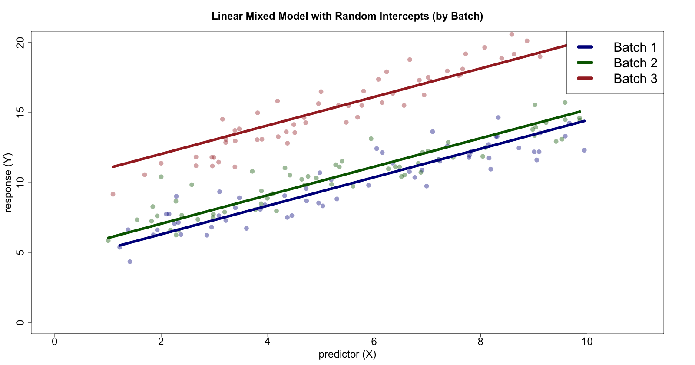

```{r setup, include = FALSE}
knitr::opts_knit$set(root.dir = rprojroot::find_rstudio_root_file()) # change wd from path dir to project dir for all chunks
figdir <- '5_stats_figures'
```

Thanks for attending my session on statistical analysis of cytometry data! If you still have questions about this topic, reach out to me at *david.novak\@ugent.be*.

*- David*

## Introduction

In the clustering session, we created and inspected a FlowSOM model. This model defines clusters (higher-resolution) and metaclusters (lower-resolution) using an aggregate of all our FCS samples. Then we used `FlowSOM::GetFeatures` to map each sample onto the FlowSOM model and extract sample-specific features:

-   metacluster counts and percentages per sample (*ie.* relative abundances)

-   median fluorescence intensities (MFIs) of state markers within FlowSOM metaclusters

Recall that the clusters and metaclusters are defined using 16 **lineage** markers. Therefore, the relative abundances are only based on this marker subset.

The MFI values are based on a separate set of 4 **state** markers. These are not used in clustering, because we want to analyse their variability **within** the clusters based on some sample genotypes.

::: {#intro style="background-color: #e8f1ff; padding: 10px;"}
In this session, we will use the FlowSOM-derived features to test for differential expression based on genotype.

We will start with a simple **non-parametric statistical model** and discuss **multiple testing correction**.

Then, we will use a **parametric model** adapted for cytometry data. This part is based on *diffcyt* [@weber2019].
:::

## Wilcoxon test

Previously, we applied `FlowSOM::GroupStats` to FlowSOM-derived features to analyse differences between two sample groups (WT vs KO).

`GroupStats` applies a **non-parametric** statistical test. Specifically, this is the Wilcoxon rank sum (or Mann-Whitney) test, implemented by `stats::wilcox.test`. The input into this test are **metacluster percentages (%MC)** from samples gathered from either of the two groups.

::: {#model-parametricity style="background-color: #e8f1ff; padding: 10px;"}
**Parametric models** **make assumptions** about our data, *eg.* that it follows a normal distribution, or some other distribution.

**Non-parametric models are more flexible**, since they do not make this assumption. On the other hand, they are generally less powerful than **parametric models that make correct assumptions about the underlying distribution**.
:::

\

We use this test (as opposed to the more widely used *t*-test) because it does not assume a normal distribution of %MC values; this is especially prudent if working with smaller data ($N_{\mathrm{WT}}=4, N_{\mathrm{KO}}=4$).

<center></center>

`wilcox.test` does not work with the raw data values themselves, but with their respective ranks when ordered. `GroupStats` reports *p*-values from the test. Specifically, the *p*-values give a probability that a **null hypothesis** is true: namely, that the two group of data points have identical distributions. At the commonly used **significance level** ($\alpha=0.05$), we reject the null hypothesis if $p<0.05$, because the *p*-value is significant.

## Multiple testing correction

In addition to raw *p*-values, `GroupStats` computes **adjusted *p*-values** using the Benjamini-Hochberg (BH) procedure to correct for multiple testing. This is to account for the fact that `wilcox.test` is applied to each metacluster ($N_{\mathrm{mc}}=25$) separately, increasing the proportion of tests deemed significant that are actually false positives. This is referred to as **multiple testing correction**.

::: {#multiple-testing style="background-color: #e8f1ff; padding: 10px;"}
Multiple testing correction can boost reliability of our tests, but can make it harder to detect true effects. Generally, correction is less urgently needed in hypothesis-generating settings if false negatives are more harmful than false positives. In this scenario, **the increased stringency introduced by correction may be less important than discovery of interesting leads**.
:::

------------------------------------------------------------------------

Let's compare the FlowSOM-derived abundances by inspecting the `wilcox.test` results.

First, we load the required packages and set up the path to our FlowSOM model.

```{r 01-packages, include = FALSE}
library(FlowSOM)        # clustering
library(tidyverse)      # working with tabular data and plotting
library(ggrepel)        # plotting text labels for points
library(flowCore)       # FCS file interfacing
suppressPackageStartupMessages(library(ComplexHeatmap)) # heatmap plotting
FlowSOMdir <- '4_clustering/FlowSOM'
```

We load the existing FlowSOM-derived feature matrices.

```{r 02-mc-perc}
feat      <- readRDS('./4_clustering/FlowSOM/features.RDS')
mc_counts <- feat$metacluster_counts
mc_perc   <- feat$metacluster_percentages
mc_mfi    <- feat$metacluster_MFIs
samples   <- rownames(mc_perc)

## Ad hoc removal of problematic sample
samples   <- samples[-1]
mc_counts <- mc_counts[-1, ]
mc_perc   <- mc_perc[-1, ]
mc_mfi    <- mc_mfi[-1, ]
```

The `FlowSOM::GroupStats` function requires us to divide our samples into groups. In our case, the group is indicated in the name of each sample (`WT` or `KO` ).

```{r 03-group-stats}
samples <- rownames(mc_perc) # basename ~ only file name, no path

groups  <- list(
  'WT' = grep(pattern = 'WT', x = samples, value = TRUE), 
  'KO' = grep(pattern = 'KO', x = samples, value = TRUE)
) # grep(value = TRUE) returns names of matched samples

stats  <- FlowSOM::GroupStats(features = mc_perc, groups = groups)
print(stats[,1:5])
```

Note the `fold changes` row which indicates how much %MC change for the `KO` group. They show this in terms of signed ratios, *ie.* a -1.27 fold change for %MC1 indicates a 27% decrease, and the 2.73 fold change for %MC2 indicates a 173% increase compared to `WT`.

## Volcano plot

Fold change is commonly reported using a logarithmic ($log_{2}$ or $log_{10}$) scale. Similarly, *p*-values can be reported as the negative logarithm ($-log_{10}$) for plotting purposes, so that higher values are attributed to significant results.

This combination of values per statistical test (log-fold change and log-*p* value) can be conveniently displayed in a **volcano plot**.

```{r 04-wilcox-volcano}
mcs <- paste0('MC', seq(from = 1, to = ncol(stats))) # metacluster names

## Collect data needed for plotting
d_wilc <- data.frame(
  'Metacluster'  = mcs,
  'neglog10p'    = stats['-log10 p values', ],
  'neglog10pAdj' = -log10(stats['adjusted p values', ]),
  'log10FC'      = stats['log10 fold changes', ]
)

## Create a volcano plot
ggplot(
  data    = d_wilc,
  mapping = aes(x = log10FC, y = neglog10pAdj)
) +
  geom_hline(yintercept = -log10(0.05), col = 'darkblue') +
  geom_point() +
  geom_label_repel(mapping = aes(label = Metacluster)) +
  ggtitle('Differential abundance of metaclusters in KO\nWilcoxon test with BH correction') +
  xlab(bquote(log[10]*' fold change')) +
  ylab(bquote(-log[10]*'p'[adj]))
```

Our plot includes a blue horizontal line for $-log_{10}(0.05)$, indicating that **only points above the line reach a *p*-value below** $\alpha$**.** We can see that no significant hits are found after the BH correction.

::: {#uncorrected-pvals style="background-color: #e8f1ff; padding: 10px;"}
We can easily project the uncorrected *p*-values by changing `y = neglog10pAdj` to `y = neglog10p` .
:::

------------------------------------------------------------------------

## *diffcyt* analysis

Based on a large body of work in genomics and transcriptomics, differential expression analyses in cytometry can use **parametric models with more statistical power**. One of the most useful frameworks for this is *diffcyt* [@weber2019]. *diffcyt* includes multiple methodologies for testing. Whichever methodology we select, two separate analyses are conducted: a **differential abundance** (DA) and **differential state** (DS) analysis.

<center>[{width="800"}](https://www.nature.com/articles/s42003-019-0415-5)</center>

In DA, we look at the %MC values. We will apply *edgeR* [@robinson2009]: a tool developed for scRNA-seq data, but treat the metacluster abundances similarly to gene counts in a transcriptomic experiment.

Under the hood, *edgeR* uses generalised linear models (GLMs), applicable to data that has a different distribution than normal. Specifically, we model the abundances using a **negative binomial** distribution. The spread of this distribution is controlled by a **dispersion** parameter, which is computed by *edgeR* for each metacluster (using a maximum likelihood estimation).

In DS, we analyse metacluster-specific MFI shifts in the state markers that we specified earlier. For this, we use simple linear models and estimate the probability that these shifts are occurring between the two groups of samples.

::: {#mixed-models style="background-color: #e8f1ff; padding: 10px;"}
In a statistical model, **fixed effects** represent specific influences on sample groups (*eg.* treatment, genotype).

**Random effects** account for general variability between different groups based on unseen factors (*eg.* remaining batch effect, sex, age, serostatus, ...).

Most commonly, we incorporate random effects by adding a **random intercept** term to the linear model formula. We can also include **random slopes**.

<center>{width="700"}</center>

To put this in a formula, we have

$$Y_{ij} = \beta_{0} + \beta_{1}X_{ij} + u_{j} + \epsilon_{ij}$$

where

-   $Y_{ij}$ is the response variable for *i*-th observation within the *j*-th group

-   $X_{ij}$ is the predictor variable ...

-   $\beta_{0}$ is the overall intercept

-   $\beta_{1}$ is the slope coefficient for the predictor variable (averaged across all groups)

-   $u_{j}$ is a random effect specific to the *j*-th group, capturing group-specific deviation from $\beta_{0}$

-   $\epsilon_{ij}$ is a residual error term, representing unexplained variability that is not captured by the fixed or the random effect

Since our response variable is categorical, our model also uses a *link function* to output the actual response (WT or KO).

To include random effects in our experiment design, we can use generalised linear mixed models (GLMMs) for DA testing and linear mixed models (LMMs) for DS testing. See `diffcyt::testDA_GLMM` and `diffcyt::testDS_LMM` if you want to apply these tests. (*edgeR* does not model random effects!)
:::

------------------------------------------------------------------------

### Designing an experiment

The set-up of our experiment will be given by a **design matrix** and a **contrast matrix**.

The design matrix expresses which sample-specific factors and covariates to consider in our analysis. Additionally, a `group_id` column can be used to specify a design with **paired samples**.

```{r 05-experiment-info}
response <- 'Genotype'                  # fixed effect
samples  <- basename(rownames(mc_perc)) # sample filenames (without path)

## Summarise info about experiment

genotypes <- factor(
    ifelse(grepl('KO', samples), 'KO', 'WT'), # label sample 'WT' or 'KO' based on its name
    levels = c('WT', 'KO') # WT first, KO second ~ KO is the positive group
)

experiment_info <- data.frame(
  'group_id'  = as.factor(1), # group ID same throughout ~ samples unpaired
  'sample_id' = samples,      # unique sample IDs
  'Genotype'  = genotypes
)
print(experiment_info)
```

```{r 06-design}
## Define model formula: outcome (KO-vs-WT) depends on Genotype
formula <- ~ Genotype

## Create design matrix from model formula and experiment info
design <- stats::model.matrix(formula, data = experiment_info)
print(design)
```

Note that each column of `design` corresponds to a term in a linear equation: the intercept ($\beta_{0}$) and the slope ($\beta_{1}$). Our contrast matrix will give a 0 or 1 for each column, specifying **comparisons of interest**. In our case, the comparison is between groups by genotype, and whether the slope modelled for each group is significantly different.

```{r 07-contrast}
contrast <- matrix(c(0, 1), nrow = 2)
print(contrast)
```

------------------------------------------------------------------------

### Differential abundance

In DA testing, *edgeR* computes its own normalisation coefficient for each sample ('trimmed mean of M values' [@robinson2010]). Therefore, we need to load the matrix of **raw metacluster counts per sample**, as opposed to percentages.

```{r 08-da-stats}
counts           <- t(mc_counts) # diffcyt works with transposed matrix
colnames(counts) <- basename(colnames(counts)) # use filenames without paths for columns
perc             <- t(mc_perc)
colnames(perc)   <- basename(colnames(perc))

samples <- colnames(perc) # all biological samples

norm_factors <- edgeR::calcNormFactors(counts, method = 'TMM')

## Treat metacluster counts as differentially expressed genes
stats_da <- edgeR::DGEList(counts, norm.factors = norm_factors)

## Fit neg-binomial distributions to each metacluster
stats_da <- edgeR::estimateDisp(stats_da, design = design)

## Fit a GLM to the data
stats_da <- edgeR::glmFit(stats_da, design = design)

## Test hypothesis (that coefficients for each group are different)
stats_da <- edgeR::glmLRT(stats_da, contrast = contrast)

## Get results for each metacluster, with multiple testing correction
res_da <- edgeR::topTags(stats_da, n = Inf, adjust.method = 'BH', sort.by = 'none')
res_da <- cbind(
  'Metacluster' = rownames(res_da$table),
  res_da$table
)
```

Now we can display our results like we did for our Wilcoxon tests. We will label all the results that turned out significant.

```{r 09-da-volcano}
## Provide labels for significant hits
labels <- paste0(res_da$Metacluster)
labels[res_da$FDR>=0.05] <- NA

## Gather results for plotting
d_da <- cbind(
  res_da,
  '-log10AdjPVal' = -log10(res_da$FDR),
  'log10FC'       = log10(2^(res_da$logFC)), # convert log2FC to log10FC
  'Label'         = labels
)

## Generate volcano plot
ggplot(d_da, aes(x = .data[['log10FC']], y = .data[['-log10AdjPVal']])) +
  geom_hline(yintercept = -log10(0.05), col = 'darkblue') +
  geom_point() +
  ggrepel::geom_label_repel(
    aes(label = .data[['Label']])
  ) +
  ggtitle('Differential abundance of metaclusters in KO\ndiffcyt-edgeR') +
  xlab(bquote(log[10]*' fold change')) +
  ylab(bquote(-log[10]*'p'[adj]))
```

The top results are consistent with the previous analysis with `wilcox.test`, but the additional statistical power causes significant results from the *edgeR* model.

Naturally, we can view the abundance values themselves and group them, in order to check the differences ourselves.

```{r 10-da-abundances}
## Concatenate %MC with sample and genotype labels
mc_perc_annot <- cbind(
  'Sample'   = samples,
  'Genotype' = genotypes,
  as.data.frame(mc_perc)
)

## Reorganise the table
input <- tidyr::pivot_longer(
  mc_perc_annot,
  cols         = paste0('%', mcs),
  names_to     = 'Metacluster',
  values_to    = 'Abundance',
  names_ptypes = factor()
)

## Plot %MC per sample, group and MC
ggplot(input, aes(x = Genotype, y = Abundance, col = Genotype)) +
  facet_wrap(~Metacluster, scales = 'free_y') + # divide into subplots by metacluster
  scale_colour_manual(values = c('darkblue', 'darkred')) +
  scale_y_continuous(labels = scales::percent) +
  geom_point(size = 1) +
  ggtitle('Metacluster abundances')
```

These relative abundances can be juxtaposed with average lineage marker expression values in each metacluster, so that we get an idea about phenotypes of cells which are over- or under-abundant in the knock-outs.

```{r 11-da-heatmaps}
## Load FlowSOM model and information about markers
fsom        <- readRDS(file.path(FlowSOMdir, 'fsom.RDS'))
marker_info <- readRDS(file.path(FlowSOMdir, 'MarkerInfo.RDS'))

## Extract lineage-marker MFIs per marker per metacluster
mc_mfis     <- FlowSOM::GetMetaclusterMFIs(fsom)[, marker_info$Channel[
  marker_info$Type=='type']]
colnames(mc_mfis) <- marker_info$Marker[marker_info$Type=='type']
rownames(mc_mfis) <- mcs

## Create a heatmap of lineage-marker MFIs per metacluster
ht_mfis <- ComplexHeatmap::Heatmap(
  matrix = as.matrix(mc_mfis),
  name = 'MFI', row_title = '', column_title = '', cluster_columns = FALSE,
  column_names_side = 'bottom', row_names_side = 'left',
  column_names_gp = grid::gpar(fontsize = 8),
  row_names_gp = grid::gpar(fontsize = 8)
)

## Use metacluster percentages as abundances
mc_abundances <- mc_perc
rownames(mc_abundances) <- basename(rownames(mc_abundances)) # use simple file names
colnames(mc_abundances) <- mcs # use simple metacluster names
mc_abundances <- t(mc_abundances) # transpose

## Create a heatmap of abundances per metacluster
ht_abundances <- ComplexHeatmap::Heatmap(
  matrix = as.matrix(mc_abundances),
  name   = 'abundance', row_title = '', column_title = '',
  cluster_columns = FALSE, cluster_rows = FALSE,
  show_row_names = FALSE, column_names_side = 'bottom',
  column_order = c(grep('WT', samples), grep('KO', samples)), # order samples by genotype
  row_order = seq(from = 1, to = length(mcs)), # order MCs by number (ascending)
  col = circlize::colorRamp2(range(mc_abundances, na.rm = TRUE),
    c('navy', 'yellow')),
  column_names_gp = grid::gpar(fontsize = 8),
  row_names_gp = grid::gpar(fontsize = 8)
)

## Create a heatmap of log-abundances per metacluster
ht_log_abundances <- ComplexHeatmap::Heatmap(
  matrix = as.matrix(log10(mc_abundances+0.0001)),
  name = '% log10(abundance)', row_title = '', column_title = '',
  cluster_columns = FALSE, cluster_rows = FALSE,
  show_row_names = FALSE, column_names_side = 'bottom',
  column_order = c(grep('WT', samples), grep('KO', samples)),
  row_order = seq(from = 1, to = length(mcs)),
  col = circlize::colorRamp2(range(log10(mc_abundances+0.0001), na.rm = TRUE),
    c('navy', 'yellow')),
  column_names_gp = grid::gpar(fontsize = 8),
  row_names_gp = grid::gpar(fontsize = 8)
)

## Combine the three heatmaps and plot
ComplexHeatmap::draw(
  ComplexHeatmap::`+.AdditiveUnit`(
    ht_mfis,
    ComplexHeatmap::`+.AdditiveUnit`(ht_abundances, ht_log_abundances)
), auto_adjust = FALSE)
```

Recall that we can also inspect the **composition of each metacluster in terms of manually defined cell populations**: this was shown in the clustering tutorial.

### Differential state

To capture differences in cell state or activation within our metaclusters, we will work with the `metacluster_MFIs` slot of the FlowSOM-derived features object.

::: {#ds-analysis-checks style="background-color: #e8f1ff; padding: 10px;"}
For DS analysis, it is especially important to check that

-   the data in each sample and batch is correctly transformed and all signal is on the same scale
-   we corrected batch effects in our data to the best of our ability

Crucially, batch effects *may* persist even after correction! Sometimes, batch effect seen on the level of metacluster abundances will be corrected, but **some batch effect on the level of metacluster-marker MFIs remains**. In that case, we can model it as a random effect in the statistical model. The model we use here, *limma* [@ritchie2015], allows for one random effect. For more complex experiment designs, we can use linear mixed models (LMMs: see `diffcyt::testDS_LMM`).
:::

\

```{r 12-ds-mfis}
mfi           <- t(mc_mfi) # diffcyt needs transposed matrix
colnames(mfi) <- basename(colnames(mfi))  # use filenames without paths for columns
rownames(mfi) <- gsub(
  ' <.*>$', '', rownames(mfi)
) # remove channel names from row names (only markers)
```

We will fit a linear model to our MFI values, using the same design and contrast matrix we used for DA.

```{r 13-ds-stats}
## Fit a model for each metacluster-marker combination
stats_ds <- limma::lmFit(mfi, design = design)

## Test hypothesis (that coefficients for each group are different)
stats_ds <- limma::contrasts.fit(stats_ds, contrasts = contrast)

## Computed moderated statistics (more stable estimates by
## sharing variance information across MC-marker combinations)
stats_ds <- limma::eBayes(stats_ds, trend = TRUE)

## Get results for each metacluster-marker test, with multiple testing correction
res_ds <- limma::topTable(
  stats_ds,
  coef          = 1,
  number        = Inf,
  adjust.method = 'BH',
  sort.by       = 'none'
)

## Compute non-log fold change and log10 fold change
logfc_to_fc <- function(x) sign(x) * (2^abs(x))

labels <- rownames(res_ds)           # MC-marker combinations
labels[res_ds$adj.P.Val>=0.05] <- NA # only label significant hits

## Gather results for plotting
res_ds <- data.frame(
  'Label'      = labels,
  'FoldChange' = logfc_to_fc(res_ds$logFC),
  'log10FC'    = log10(2^(res_ds$logFC)),
  res_ds
)
d_ds <- cbind(
  res_ds,
  '-log10AdjPVal' = -log10(res_ds$adj.P.Val)
)

## Create volcano plot
ggplot(d_ds, aes(x = .data[['log10FC']], y = .data[['-log10AdjPVal']])) +
  geom_hline(yintercept = -log10(0.05), col = 'darkblue') +
  geom_point() +
  ggrepel::geom_label_repel(
    aes(label = .data[['Label']])
  ) +
  ggtitle('Differential state of metaclusters in KO\ndiffcyt-limma') +
  xlab(bquote(log[10]*' fold change')) +
  ylab(bquote(-log[10]*'p'[adj]))
```

We can see some significant results of varying effect sizes.

::: {#median-vs-posneg style="background-color: #e8f1ff; padding: 10px;"}
These results are valid under the **assumption that the *median* signal per marker is relevant**.

If we are dealing with strictly bimodally expressed markers, we can also compute the **percentage of cells with positive phenotype for a given marker**, within our metaclusters. To do this, take a look at the `FlowSOM::GetFeatures` function and the `positive_cutoffs` argument.
:::

\

Since the MFIs give no information about the entire distribution of our signals, it is a good idea to inspect these distribution for (at least) the top hit s identified by our tests. We will extract the entire signal distributions from the respective sample FCS files.

```{r 14-ds-signals-load}
## Select a metacluster-marker combination
mc      <- 25
marker  <- 'CD103'
samples <- rownames(mc_perc) # full paths to all samples

## Extract signal for this compartment from each sample
signals       <- vector(mode = 'list', length = length(samples))
names(signals) <- basename(samples)
for (i in seq_along(samples)) {
  s <- samples[i]
  message(basename(s), ' (', i, '/', length(samples), ')')
  
  ## Load FCS file
  ff <- flowCore::read.FCS(s)
  
  ## Get column index of marker
  mn      <- flowCore::markernames(ff)
  col_idx <- names(mn)[grep(marker, mn)]
  
  ## Map sample onto FlowSOM
  fsom_ff <- FlowSOM::NewData(fsom = fsom, input = ff)
  
  ## Get row indices of metacluster
  all_mc_idcs <- FlowSOM::GetMetaclusters(fsom = fsom_ff)
  row_idcs <- which(all_mc_idcs==mc)
  
  ## Get signal and save it
  signal <- ff@exprs[row_idcs, col_idx]
  signals[[i]] <- signal
}
```

Using this data, we can plot the signal density estimates, not only per group but per each sample.

```{r 14-ds-signals-plot}
## Get numbers of events per sample
l <- sapply(signals, length)
message(
  'Cell count per sample:\n\t',
  paste(paste(names(l), ':\t', l), collapse = '\n\t')
)

## Prepare data for plotting
d_dens <- data.frame(
  'Signal'   = unlist(signals),                           # concatenated signal data
  'Sample'   = as.factor(rep(names(signals), times = l)), # aligned sample names
  'Genotype' = as.factor(rep(genotypes, times = l))       # aligned genotypes
)

## Set up a colour legend: blue for WT, red for KO, different
## transparency for each sample
colours <- rep(NA, times = length(samples))
n_wt    <- sum(genotypes=='WT')
n_ko    <- sum(genotypes=='KO')
colours[genotypes=='WT'] <- scales::alpha(
  colour = 'darkblue',
  alpha = seq(from = 1.0, to = 0.4, length.out = n_wt)
)
colours[genotypes=='KO'] <- scales::alpha(
  colour = 'darkred',
  alpha = seq(from = 1.0, to = 0.4, length.out = n_ko)
)

## Plot densities
ggplot(d_dens, aes(x = Signal, col = Sample)) +
  scale_colour_manual(values = colours) +
  geom_density() +
  ggtitle(paste0('Signal densities of ', marker, ' in metacluster ', mc))
```

Finally, we will plot the state marker MFI shift heatmaps (for significant hits).

```{r 15-ds-heatmaps}
## Identify significant hits
signif        <- rownames(res_ds)[res_ds$adj.P.Val < 0.05]
mc_state_mfis <- mfi[signif, ]

## Create a heatmap of state-marker MFIs per significant result
ht_state_mfis <- ComplexHeatmap::Heatmap(
  matrix = as.matrix(mc_state_mfis),
  name   = 'abundance', row_title = '', column_title = '',
  cluster_columns = FALSE, cluster_rows = FALSE,
  show_row_names = TRUE, column_names_side = 'bottom',
  column_order = c(grep('WT', samples), grep('KO', samples)), # order samples by genotype
  col = circlize::colorRamp2(range(mc_state_mfis, na.rm = TRUE),
    c('navy', 'yellow'))
)

## Combine the two heatmaps and plot
ComplexHeatmap::draw(ht_state_mfis)
```

## Exercise

In differential abundance testing, we compared the results of `FlowSOM::GroupStats` with the parametric testing alternative (*edgeR*). For differential state testing, we haven't done this comparison yet.

Complete the code below to apply the non-parametric `wilcox.test` to metacluster MFIs and report your results in a volcano plot. Are there any significant hits?

**Note.** The solution is included now. :)

```{r 16-exercise-ds-wilcox}
## Extract metacluster MFIs 
mfis <- feat$metacluster_MFIs

## Make column names shorter
colnames(mfis) <- gsub(' <.*>$', '', colnames(mfis))

## Compute stats
mfi_stats <- FlowSOM::GroupStats(features = mfis, groups = groups)

## Prepare data for plotting
d_mfi_wilc <- data.frame(
  'Label'        = colnames(mfi_stats),
  'neglog10p'    = mfi_stats['-log10 p values', ],
  'neglog10pAdj' = -log10(mfi_stats['adjusted p values', ]),
  'log10FC'      = mfi_stats['log10 fold changes', ]
)

## Create a volcano plot
ggplot(
  data    = d_mfi_wilc,
  mapping = aes(x = log10FC, y = neglog10pAdj)
) +
  geom_hline(yintercept = -log10(0.05), col = 'darkblue') +
  geom_point() +
  geom_label_repel(mapping = aes(label = Label)) +
  ggtitle('Differential state of metaclusters in KO\nWilcoxon test with BH correction') +
  xlab(bquote(log[10]*' fold change')) +
  ylab(bquote(-log[10]*'p'[adj]))
```

------------------------------------------------------------------------

For more information on differential expression analyses, you can follow this [diffcyt workflow](https://www.bioconductor.org/packages/devel/bioc/vignettes/diffcyt/inst/doc/diffcyt_workflow.html) vignette. Other relevant tools include *CellCnn* [@arvaniti2017] and *CytoGLMM* [@seiler2021].

------------------------------------------------------------------------

## References
